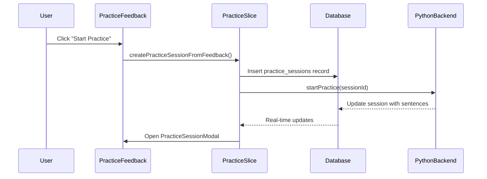
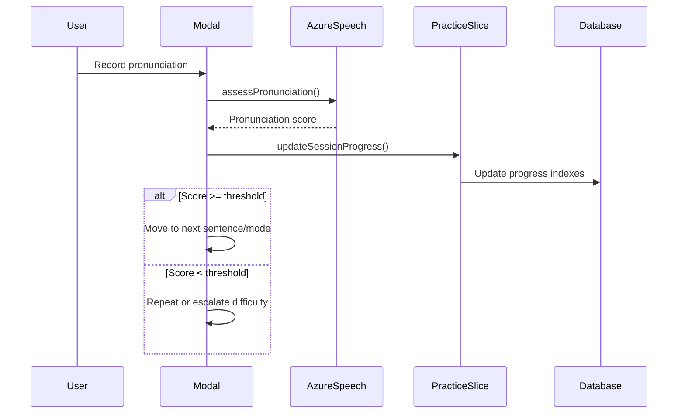

# Practice Feature - Complete Architecture Documentation

## Overview

The Practice Feature is a comprehensive pronunciation learning system that transforms assignment feedback into structured, progressive practice sessions. It integrates AI-powered transcript enhancement, real-time pronunciation assessment, and adaptive difficulty progression to provide personalized language learning experiences.

## Table of Contents

1. [Architecture Overview](#architecture-overview)
2. [Database Schema](#database-schema)
3. [Core Components](#core-components)
4. [Data Flow & State Management](#data-flow--state-management)
5. [External Service Integrations](#external-service-integrations)
6. [User Journeys](#user-journeys)
7. [Technical Implementation Details](#technical-implementation-details)
8. [Integration Points](#integration-points)

## Architecture Overview

The practice feature follows a modular architecture with clear separation of concerns:

```
┌─────────────────────┐    ┌─────────────────────┐    ┌─────────────────────┐
│   Frontend (React)  │    │   External APIs     │    │   Database Layer    │
│                     │    │                     │    │                     │
│  Practice Components├────┤  Python Backend     │    │  Supabase/PostgreSQL│
│  Redux State Mgmt   │    │  Azure Speech API   │    │  practice_sessions  │
│  Modal System       │    │  Supabase Real-time │    │  Real-time Updates  │
└─────────────────────┘    └─────────────────────┘    └─────────────────────┘
```

### Key Architectural Principles

- **Progressive Difficulty**: Automatic escalation through practice modes based on performance
- **Real-time Assessment**: Live pronunciation feedback using Azure Speech Services
- **State Persistence**: Session progress stored and synchronized with database
- **Modal-based UI**: Global modal system for consistent practice experience
- **Multiple Entry Points**: Practice accessible from assignments, feedback, and navigation

## Database Schema

### practice_sessions Table

```sql
create table public.practice_sessions (
  id uuid not null default gen_random_uuid (),
  user_id uuid not null,
  original_audio_url text null,
  original_transcript text null,
  improved_transcript text null,
  sentences jsonb null,
  current_sentence_index integer null default 0,
  current_word_index integer null default 0,
  problematic_words jsonb null,
  status public.practice_session_status not null default 'transcript_processing'::practice_session_status,
  webhook_session_id text null,
  error_message text null,
  created_at timestamp with time zone null default now(),
  updated_at timestamp with time zone null default now(),
  completed_at timestamp with time zone null,
  highlights jsonb[] null,
  assignment_id uuid null,
  constraint practice_sessions_pkey primary key (id),
  constraint practice_sessions_assignment_id_fkey foreign KEY (assignment_id) references assignments (id),
  constraint practice_sessions_user_id_fkey foreign KEY (user_id) references users (id)
)
```

### Session Status Progression

```
transcript_processing → transcript_ready → practicing_sentences → 
practicing_words → practicing_full_transcript → completed
```

### Key Schema Features

- **Progress Tracking**: `current_sentence_index` and `current_word_index` track user progress
- **Content Storage**: `sentences` and `problematic_words` store practice content as JSONB
- **Assignment Linking**: Optional `assignment_id` connects practice to specific assignments
- **Highlighting System**: `highlights` array stores user-selected focus areas
- **External Integration**: `webhook_session_id` links to Python backend processing

## Core Components

### 1. Practice Service Layer

#### practiceService.ts
- **Purpose**: External API communication with Python backend
- **Key Functions**:
  - `testApiKey()`: Health check for backend availability
  - `startPractice(sessionId)`: Initiates backend transcript processing
  - `getSessionStatus(sessionId)`: Retrieves processing status
- **Integration**: Handles Python backend at `classconnect-staging-107872842385.us-west2.run.app`

#### azureSpeechService.ts
- **Purpose**: Real-time pronunciation assessment
- **Key Functions**:
  - `assessPronunciation(audioBlob, referenceText)`: Main assessment function
  - `convertToWav()`: Audio format conversion for Azure compatibility
  - `parsePronunciationResult()`: Processes Azure response
- **Technical Details**:
  - Converts WebM recordings to WAV (16kHz, mono, PCM)
  - Implements phoneme-level pronunciation feedback
  - Returns overall scores and identifies weak words

### 2. State Management

#### practiceSlice.ts
- **Purpose**: Central Redux slice for all practice state
- **Key Async Thunks**:
  - `createPracticeSessionFromFeedback()`: Creates sessions from enhanced transcripts
  - `loadPracticeFeedbackFromSubmission()`: Loads feedback data
  - `assessPronunciationInSession()`: Handles pronunciation assessment
  - `updateSessionProgress()`: Syncs progress to database
  - `startPracticeSession()`: Initiates backend processing

#### State Structure
```typescript
interface PracticeState {
  currentSession: PracticeSession | null;
  isLoading: boolean;
  error: string | null;
  isModalOpen: boolean;
  isAssignmentPracticeModalOpen: boolean;
  practiceFeedbackData: PracticeFeedbackData | null;
  highlights: WordHighlight[];
  completedSessionIds: string[];
}
```

### 3. UI Components

#### PracticeSessionModal.tsx
- **Purpose**: Main practice execution interface
- **Practice Modes**:
  1. **Sentence Mode**: Practice individual sentences (70% threshold)
  2. **Word-by-Word Mode**: Focus on problematic words (80% threshold)
  3. **Full Transcript Mode**: Practice entire transcript (35% threshold)
- **Features**:
  - Real-time pronunciation assessment
  - Auto-progression based on scores
  - Visual feedback and progress tracking
  - Audio playback using browser TTS

#### AssignmentPracticeModal.tsx
- **Purpose**: Assignment-specific practice interface
- **Features**:
  - Recording and playback for assignment questions
  - Integration with improved transcripts
  - Navigation to practice feedback
  - Assignment context preservation

#### PracticeFeedback.tsx
- **Purpose**: Bridge between feedback and practice
- **Key Functions**:
  - Display original vs enhanced transcripts
  - Word highlighting for focused practice
  - Practice session creation from enhanced content
  - Completion status management

### 4. Page Components

#### AssignmentPractice.tsx
- **Purpose**: Assignment recording and practice entry point
- **Features**:
  - Audio recording for assignment questions
  - Test mode support with timing constraints
  - Practice modal integration
  - Progress tracking and submission

#### GeneralPractice.tsx
- **Purpose**: General practice entry point
- **Current State**: Redirects to dashboard (simplified implementation)

## Data Flow & State Management

### 1. Starting Practice from Feedback



### 2. Practice Session Execution



### 3. State Synchronization

- **Real-time Updates**: Supabase subscriptions for live session updates
- **Fallback Polling**: Automatic fallback when real-time connections fail
- **Optimistic Updates**: UI updates immediately with server sync
- **Error Handling**: Graceful degradation with error boundaries

## External Service Integrations

### 1. Python Backend Integration
- **Endpoint**: `https://classconnect-staging-107872842385.us-west2.run.app`
- **Purpose**: Transcript processing and sentence generation
- **Communication**:
  - `POST /test-api-key`: Health check
  - `POST /start-practice`: Initiate session processing
  - `GET /session-status/{id}`: Check processing status

### 2. Azure Speech Services
- **Purpose**: Real-time pronunciation assessment
- **Configuration**:
  - Audio format: WAV, 16kHz, mono, PCM
  - Assessment mode: Pronunciation assessment with phonemes
  - Scoring: Word-level and phoneme-level accuracy
- **Features**:
  - Real-time pronunciation scoring
  - Phoneme-level feedback
  - Problematic word identification

### 3. Supabase Integration
- **Database**: PostgreSQL with real-time subscriptions
- **Storage**: Audio file storage for practice recordings
- **Real-time**: Live updates for session progress
- **Auth**: Row-level security for user data isolation

## User Journeys

### 1. Practice from Assignment Feedback

```
Assignment Completion → Feedback View → Enhanced Transcript → 
Word Highlighting → Start Practice → Progressive Practice Modes → 
Completion Feedback → Return to Feedback
```

### 2. Assignment-Specific Practice

```
Assignment Page → Practice Button → Recording Modal → 
Audio Recording → Transcript Generation → Practice Session → 
Feedback Review → Assignment Completion
```

### 3. General Practice Access

```
Navigation Menu → Practice Link → Luna Onboarding Check → 
Practice Dashboard → Session Selection → Practice Execution
```

## Technical Implementation Details

### 1. Audio Processing Pipeline

```typescript
// Audio Recording Flow
WebRTC Recording (WebM) → Format Conversion (WAV) → 
Azure Speech API → Pronunciation Assessment → 
Score Calculation → Progress Decision
```

### 2. Progressive Difficulty Algorithm

```typescript
// Practice Mode Progression
if (sentenceScore >= 70%) {
  // Continue to next sentence
  moveToNextSentence();
} else if (attempts >= maxAttempts) {
  // Escalate to word-by-word mode
  switchToWordMode();
} else {
  // Repeat sentence
  retryCurrentSentence();
}
```

### 3. Real-time State Synchronization

```typescript
// Supabase Real-time Integration
supabase
  .channel('practice-sessions')
  .on('postgres_changes', {
    event: 'UPDATE',
    schema: 'public',
    table: 'practice_sessions',
    filter: `id=eq.${sessionId}`
  }, handleSessionUpdate)
  .subscribe();
```

### 4. Error Handling Strategy

- **Network Failures**: Automatic retry with exponential backoff
- **Audio Processing**: Graceful fallback to text-only mode
- **Service Outages**: Clear error messages with recovery options
- **Session Recovery**: Resume from last known progress state

## Integration Points

### 1. Global Modal System

The practice modals are rendered globally in `Layout.tsx`:

```typescript
<AssignmentPracticeModal />
<PracticeSessionModalWrapper />
```

This allows practice to be triggered from anywhere in the application without prop drilling.

### 2. Routing Configuration

Practice routes are configured in `routes/index.tsx`:

- `/student/practice` - General practice
- `/student/practice-feedback` - Practice feedback view
- `/student/assignment/:id/practice` - Assignment-specific practice

### 3. Navigation Integration

Practice is accessible through:
- **NavBar**: Global practice link with Luna onboarding check
- **Assignment Cards**: Practice buttons on assignment tiles
- **Feedback Pages**: Practice initiation from enhanced transcripts
- **Deep Links**: Direct URL access to practice sessions

### 4. State Management Integration

The practice slice is integrated into the global Redux store:

```typescript
export const store = configureStore({
  reducer: {
    // ... other reducers
    practice: practiceReducer,
  },
});
```

With proper state reset on authentication changes and middleware integration.

## Performance Considerations

### 1. Audio Processing Optimization

- **Format Conversion**: Efficient WebM to WAV conversion in browser
- **Chunked Upload**: Large audio files uploaded in chunks
- **Compression**: Audio compression for storage optimization

### 2. Real-time Performance

- **Connection Pooling**: Efficient Supabase connection management
- **Subscription Cleanup**: Proper cleanup of real-time subscriptions
- **Fallback Mechanisms**: Polling fallback for unreliable connections

### 3. State Management Efficiency

- **Selective Updates**: Only update relevant UI components
- **Memoization**: React.memo and useMemo for expensive computations
- **Debounced Actions**: Throttled progress updates to database

## Security Considerations

### 1. Data Protection

- **Row-level Security**: Database policies restrict access to user's own sessions
- **Audio Storage**: Secure file upload with user-scoped access
- **API Authentication**: Proper JWT token validation

### 2. Input Validation

- **Audio Validation**: File type and size validation before processing
- **Session Validation**: Server-side validation of session ownership
- **Content Sanitization**: XSS protection for user-generated content

## Future Enhancement Opportunities

### 1. Performance Improvements

- **Audio Streaming**: Real-time audio streaming for faster assessment
- **Offline Support**: Practice mode without internet connectivity
- **Caching Strategy**: Intelligent caching of assessment results

### 2. Feature Expansions

- **Multi-language Support**: Extended language support beyond English
- **Advanced Analytics**: Detailed pronunciation progress tracking
- **Social Features**: Shared practice sessions and peer feedback
- **Gamification**: Achievement system and progress rewards

### 3. Technical Enhancements

- **WebRTC Optimization**: Improved audio quality and latency
- **AI Integration**: Enhanced transcript improvement algorithms
- **Mobile Optimization**: Better mobile recording and playback experience

## Conclusion

The Practice Feature represents a sophisticated, well-architected system that successfully integrates multiple complex technologies to provide a seamless pronunciation learning experience. Its modular design, robust state management, and progressive difficulty system make it a valuable tool for language learners while maintaining excellent technical standards and user experience.

The architecture demonstrates good software engineering practices with clear separation of concerns, comprehensive error handling, and scalable integration patterns that can support future enhancements and growth.